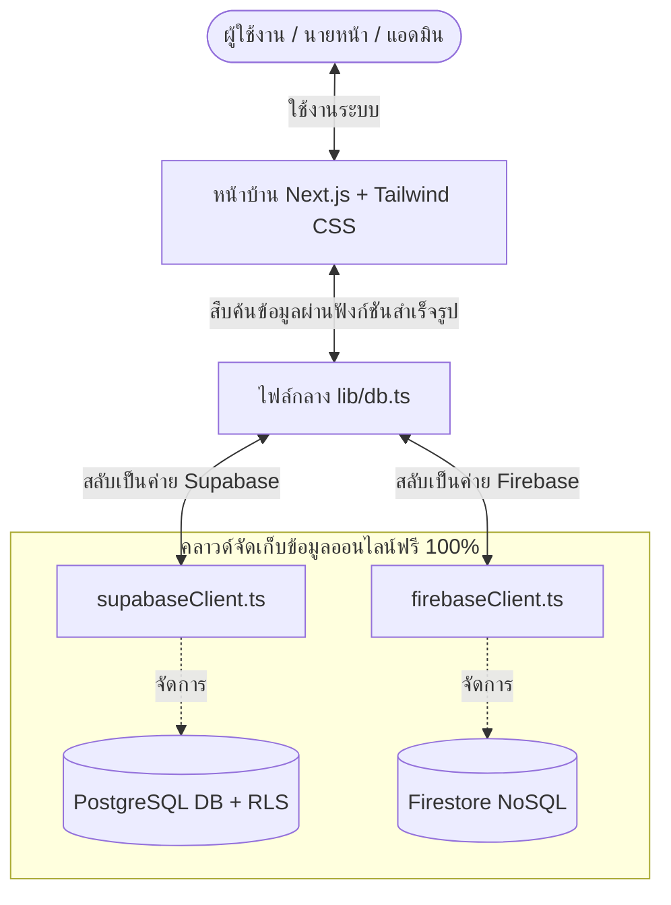

# 🏆 แผนแม่บทการพัฒนา Srichai Property (Full-Stack Next.js + Supabase / Firebase Compatible - ฟรี 100%)

แผนงานโครงการฉบับสมบูรณ์ที่สุดนี้ รวบรวมกระบวนการพัฒนาเว็บแอปพลิเคชันอสังหาริมทรัพย์ Srichai Property ตั้งแต่การตั้งค่าฐานรากโครงการไปจนถึงฟังก์ชันการทำงานจริงทุกส่วน โดยถอดแบบจากไฟล์ตัวอย่างดีไซน์ในโฟลเดอร์ `d:\SrichaiProperty\ExProject` ครอบคลุมทั้งฝั่ง **ลูกค้า, นายหน้า, แอดมิน** ด้วยระบบที่ **เรียบง่าย สะดวก ปลอดภัย ฟรี 100% และพร้อมขยายขีดความสามารถในอนาคต**

---

## 💻 1. สถาปัตยกรรมระบบหลัก (System Architecture)

เพื่อลดขั้นตอนและความซับซ้อน เราจะใช้สถาปัตยกรรมแบบ **Backendless** ที่หน้าบ้านต่อหาฐานข้อมูลโดยตรงผ่านตัวสวิตช์สลับค่าย (`lib/db.ts`):



---

## 📂 2. การจัดแยกโฟลเดอร์และการจับคู่ไฟล์ต้นแบบ (Route Map)

พอร์ตหน้าจอทั้งหมดจากโฟลเดอร์ `ExProject` เข้าสู่ระบบ Routing App Router ของ Next.js:

```text
srichai-property/
├── app/                              # หน้าเพจทั้งหมด (Next.js App Router)
│   ├── layout.tsx                    # โครงสร้างเพจหลัก (โหลด CSS และฟอนต์ภาษาไทย Prompt)
│   ├── page.tsx                      # [ExProject: ผู้ใช้/main.html] หน้าแรกสำหรับบุคคลทั่วไป
│   │
│   ├── (customer)/                   # [ส่วนลูกค้า - ต้นแบบในแฟ้ม 'ผู้ใช้']
│   │   ├── home/page.tsx             # [ExProject: ผู้ใช้/home.html] หน้าแรกหลังเข้าระบบ
│   │   ├── search/page.tsx           # [ExProject: ผู้ใช้/search.html] หน้าค้นหาตัวกรองราคาบ้าน
│   │   ├── property/[id]/page.tsx    # [ExProject: ผู้ใช้/property-detail.html] รายละเอียดประกาศบ้าน
│   │   ├── book-appointment/page.tsx # [ExProject: ผู้ใช้/book-appointment.html] ปฏิทินจองนัดหมายเข้าชม
│   │   ├── appointments/page.tsx     # [ExProject: ผู้ใช้/appointment.html] ประวัตินัดจองของลูกค้า
│   │   ├── favorites/page.tsx        # [ExProject: ผู้ใช้/favorites.html] รายการบ้านโปรด
│   │   ├── chat/page.tsx             # [ExProject: ผู้ใช้/chat.html] ห้องแชทสดคุยกับนายหน้า
│   │   ├── profile/page.tsx          # [ExProject: ผู้ใช้/profile.html] ตั้งค่าประวัติลูกค้า
│   │   └── agents/page.tsx           # [ExProject: ผู้ใช้/agents.html] รายชื่อนายหน้าทั้งหมด
│   │
│   ├── (agent)/                      # [ส่วนนายหน้า - ต้นแบบในแฟ้ม 'นายหน้า']
│   │   ├── agent/dashboard/page.tsx  # [ExProject: นายหน้า/dashboard.html] แดชบอร์ดสรุปยอดขาย
│   │   ├── agent/add-property/page.tsx # [ExProject: นายหน้า/add-property.html] ฟอร์มอัปประกาศและรูปบ้าน
│   │   ├── agent/appointments/page.tsx # [ExProject: นายหน้า/appointments.html] หน้ายอมรับคิวจอง
│   │   ├── agent/chat/page.tsx       # [ExProject: นายหน้า/agent-chat.html] แชทคุยกับลูกค้า
│   │   ├── agent/profile/page.tsx    # [ExProject: นายหน้า/profile.html] ตั้งเวลาทำงานนายหน้า
│   │   ├── agent/boost/page.tsx      # [ExProject: นายหน้า/boost.html] หน้าซื้อสิทธิ์ดันประกาศ
│   │   ├── agent/report/page.tsx     # [ExProject: นายหน้า/report.html] หน้ารายงานสรุปผล
│   │   └── agent/wait/page.tsx       # [ExProject: นายหน้า/wait.html] หน้าแจ้งรอการยืนยัน KYC
│   │
│   ├── (admin)/                      # [ส่วนแอดมิน - ต้นแบบในแฟ้ม 'แอดมิน']
│   │   ├── admin/dashboard/page.tsx  # [ExProject: แอดมิน/home.html] หน้าแอดมินหลัก
│   │   ├── admin/kyc/page.tsx        # [ExProject: แอดมิน/kyc.html] ตรวจอนุมัติเอกสารนายหน้า
│   │   ├── admin/moderation/page.tsx # [ExProject: แอดมิน/moderation.html] ตรวจสอบประกาศอสังหาฯ ขึ้นเว็บ
│   │   ├── admin/users/page.tsx      # [ExProject: แอดมิน/users.html] จัดการแบนสมาชิก
│   │   ├── admin/appointments/page.tsx # [ExProject: แอดมิน/appointment.html] ประวัตินัดหมายทั้งหมด
│   │   ├── admin/banners/page.tsx    # [ExProject: แอดมิน/banners.html] ปรับแต่งป้ายแบนเนอร์
│   │   ├── admin/master-data/page.tsx # [ExProject: แอดมิน/master_data.html] ข้อมูลพื้นฐานระบบ
│   │   └── admin/reports/page.tsx     # [ExProject: แอดมิน/reports.html] เรื่องร้องเรียนความผิดปกติ
│   │
│   └── (auth)/                       # [ระบบสิทธิ์]
│       ├── login/page.tsx            # [ExProject: ผู้ใช้/login.html] หน้าเข้าสู่ระบบ
│       └── register/page.tsx         # [ExProject: ผู้ใช้/register.html] หน้าสมัครสมาชิก
│
├── components/                       # ส่วนประกอบ UI ย่อยเรียกใช้งานซ้ำเพื่อความเป็นระเบียบ
│   ├── Navbar.tsx                    # แถบเมนูด้านบน (เปลี่ยนปุ่มตามประเภทผู้ใช้งานที่ล็อกอิน)
│   ├── Footer.tsx                    # ข้อมูลส่วนท้ายสุดของเพจ
│   └── PropertyCard.tsx              # ส่วนแสดงผลกล่องประกาศบ้านรายชิ้น
│
├── locales/                          # [เตรียมเพื่ออนาคต: รองรับระบบ 2 ภาษา]
│   ├── th.json                       # คำแปลภาษาไทย
│   └── en.json                       # คำแปลภาษาอังกฤษ
│
├── lib/                              # เลเยอร์กลางจัดการฐานข้อมูล
│   ├── db.ts                         # สวิตช์สลับฐานข้อมูล (Supabase / Firebase)
│   ├── supabaseClient.ts             # โค้ดเชื่อมต่อเฉพาะของ Supabase
│   └── firebaseClient.ts             # โค้ดเชื่อมต่อเฉพาะของ Firebase
│
└── styles/globals.css                # ดีไซน์สไตล์หลัก Tailwind CSS
```

---

## 🗄️ 3. การออกแบบฐานข้อมูลออนไลน์ (Database Tables Setup)

นำชุดคำสั่ง SQL ด้านล่างไปรันในช่อง SQL Editor ของ Supabase เพื่อจัดเตรียมตารางได้ทันที:

```sql
-- 1. ตารางข้อมูลประวัติผู้ใช้ (Profiles)
CREATE TABLE profiles (
  id UUID REFERENCES auth.users ON DELETE CASCADE PRIMARY KEY,
  email TEXT NOT NULL UNIQUE,
  full_name TEXT,
  role TEXT DEFAULT 'customer' CHECK (role IN ('customer', 'agent', 'admin')),
  kyc_status TEXT DEFAULT 'none' CHECK (kyc_status IN ('none', 'pending', 'approved', 'rejected')),
  kyc_docs_url TEXT,
  phone_number TEXT,                     -- [เตรียมเผื่ออนาคต: เบอร์โทรติดต่อตรง]
  line_id TEXT,                          -- [เตรียมเผื่ออนาคต: LINE ID ติดต่อตรง]
  created_at TIMESTAMP WITH TIME ZONE DEFAULT TIMEZONE('utc'::text, NOW()) NOT NULL
);

-- 2. ตารางประกาศบ้าน (Properties)
CREATE TABLE properties (
  id UUID DEFAULT gen_random_uuid() PRIMARY KEY,
  title TEXT NOT NULL,
  price NUMERIC NOT NULL,
  type TEXT CHECK (type IN ('house', 'townhome', 'condo')),
  location TEXT NOT NULL,
  latitude NUMERIC,                     -- [เตรียมเผื่ออนาคต: ระบบแผนที่ปักหมุด คอนโด/บ้าน]
  longitude NUMERIC,                    -- [เตรียมเผื่ออนาคต: ระบบแผนที่ปักหมุด คอนโด/บ้าน]
  description TEXT,
  bedrooms INTEGER DEFAULT 1,
  bathrooms INTEGER DEFAULT 1,
  area_sqm NUMERIC,
  images TEXT[] DEFAULT '{}',
  agent_id UUID REFERENCES profiles(id) ON DELETE CASCADE,
  status TEXT DEFAULT 'pending' CHECK (status IN ('pending', 'approved', 'rejected')),
  created_at TIMESTAMP WITH TIME ZONE DEFAULT TIMEZONE('utc'::text, NOW()) NOT NULL
);

-- 3. ตารางคิวจองนัดหมาย (Appointments)
CREATE TABLE appointments (
  id UUID DEFAULT gen_random_uuid() PRIMARY KEY,
  customer_id UUID REFERENCES profiles(id) ON DELETE CASCADE,
  agent_id UUID REFERENCES profiles(id) ON DELETE CASCADE,
  property_id UUID REFERENCES properties(id) ON DELETE CASCADE,
  appointment_date DATE NOT NULL,
  time_slot TEXT CHECK (time_slot IN ('morning', 'afternoon')),
  status TEXT DEFAULT 'pending' CHECK (status IN ('pending', 'approved', 'rejected')),
  note TEXT,
  created_at TIMESTAMP WITH TIME ZONE DEFAULT TIMEZONE('utc'::text, NOW()) NOT NULL
);

-- 4. ตารางประวัติข้อความแชท (Chat Messages)
CREATE TABLE chat_messages (
  id UUID DEFAULT gen_random_uuid() PRIMARY KEY,
  sender_id UUID REFERENCES profiles(id) ON DELETE CASCADE,
  receiver_id UUID REFERENCES profiles(id) ON DELETE CASCADE,
  content TEXT NOT NULL,
  created_at TIMESTAMP WITH TIME ZONE DEFAULT TIMEZONE('utc'::text, NOW()) NOT NULL
);

-- 5. ตารางประวัติแจ้งเตือนในเว็บ (Notifications)
CREATE TABLE notifications (
  id UUID DEFAULT gen_random_uuid() PRIMARY KEY,
  user_id UUID REFERENCES profiles(id) ON DELETE CASCADE,
  title TEXT NOT NULL,
  content TEXT NOT NULL,
  is_read BOOLEAN DEFAULT FALSE,
  created_at TIMESTAMP WITH TIME ZONE DEFAULT TIMEZONE('utc'::text, NOW()) NOT NULL
);
```

---

## 🔒 4. กำแพงความปลอดภัยของข้อมูล (Row Level Security - RLS)

นโยบาย RLS ที่เราจะเซ็ตอัปบนระบบฐานข้อมูลเพื่อป้องกันช่องโหว่ความปลอดภัย:

```sql
-- เปิดใช้ RLS ให้ทุกตาราง
ALTER TABLE profiles ENABLE ROW LEVEL SECURITY;
ALTER TABLE properties ENABLE ROW LEVEL SECURITY;
ALTER TABLE appointments ENABLE ROW LEVEL SECURITY;
ALTER TABLE chat_messages ENABLE ROW LEVEL SECURITY;
ALTER TABLE notifications ENABLE ROW LEVEL SECURITY;

-- 1. ตาราง Properties: ทุกคนอ่านโพสต์ที่อนุมัติได้ แต่นายหน้าแก้ไขได้เฉพาะของตนเอง
CREATE POLICY "Public read approved" ON properties FOR SELECT USING (status = 'approved');
CREATE POLICY "Agent edit own properties" ON properties FOR ALL USING (auth.uid() = agent_id);

-- 2. ตาราง Appointments: ลูกค้าผู้จองและนายหน้ารายนั้นๆ เท่านั้นที่เข้าถึงคิวจอง
CREATE POLICY "Access only if user is customer or agent" ON appointments FOR ALL USING (auth.uid() = customer_id OR auth.uid() = agent_id);

-- 3. ตาราง Chat Messages: เปิดให้เข้าอ่านและพิมพ์เฉพาะผู้ส่งหรือผู้รับข้อความในห้องนั้นๆ
CREATE POLICY "Read write chat for participants" ON chat_messages FOR ALL USING (auth.uid() = sender_id OR auth.uid() = receiver_id);

-- 4. ตาราง Notifications: อนุญาตให้เฉพาะเจ้าของบัญชีเท่านั้นในการอ่านและแก้ไขการแจ้งเตือนของตนเอง
CREATE POLICY "Allow read write own notifications" ON notifications FOR ALL USING (auth.uid() = user_id);
```

---

## 🔄 5. แผนการไหลของข้อมูลในระบบอย่างละเอียด (Detail Core Workflows)

### 5.1 ระบบตรวจสอบเอกสารนายหน้า (KYC Verification Workflow)
1. **การลงทะเบียน**: นายหน้าสมัครบัญชีในเพจ `/register` -> ระบบสร้างบัญชีสถานะ `role = 'agent'` และตั้งสิทธิ์ `kyc_status = 'pending'` 
2. **การอัปโหลด**: นายหน้าอัปโหลดรูปถ่ายบัตรประชาชนเข้าสู่บักเก็ตความปลอดภัยแบบ Private `kyc-documents`
3. **การคัดกรอง**: นายหน้าจะติดอยู่ที่หน้าเพจ `/agent/wait` โดยอัตโนมัติ (เข้าแดชบอร์ดอื่นไม่ได้) จนกว่าแอดมินจะกดอนุมัติสิทธิ์
4. **การอนุมัติ**: แอดมินเข้ามาตรวจที่เพจ `/admin/kyc` เพื่อตรวจสอบเอกสาร บัญชีที่ผ่านจะเปลี่ยนสิทธิ์เป็่น `kyc_status = 'approved'` และเด้งผ่านหน้าจอรอนี้ไปสู่หน้าแดชบอร์ดทำงานได้ทันที

### 5.2 ระบบลงข้อมูลและอนุมัติประกาศบ้าน (Property Submission & Moderation)
1. **การสร้างโพสต์**: นายหน้าที่ยืนยัน KYC ผ่านแล้ว กดลงประกาศในเพจ `/agent/add-property` ป้อนรายละเอียด พิกัดปักหมุด และอัปโหลดรูปภาพ
2. **การบีบอัดรูปภาพฝั่งหน้าบ้าน**: ก่อนส่งภาพขึ้นคลาวด์ ระบบ Next.js จะนำภาพไปเข้าโมดูลย่อยย่อไฟล์ภาพให้อยู่ในช่วง 300KB-500KB เพื่อประหยัดเนื้อที่คลาวด์ฟรีและให้รูปภาพโหลดหน้าเว็บได้อย่างรวดเร็ว
3. **คิวตรวจสอบ**: ข้อมูลบ้านจะถูกเซฟด้วยสถานะเริ่มต้น `status = 'pending'` 
4. **การอนุมัติขึ้นเว็บ**: แอดมินเข้าหน้าเพจ `/admin/moderation` เพื่อตรวจสอบรายละเอียดบ้าน หากถูกต้องแอดมินจะคลิกอนุมัติเพื่อปรับสถานะบ้านเป็น `status = 'approved'` ประกาศจะออนไลน์บนระบบและพร้อมดึงข้อมูลมาแสดงที่หน้าแรกและหน้าจอกรองเสิร์ชข้อมูลทันที

### 5.3 ระบบจองนัดหมายเข้าดูบ้าน (Appointment Booking Engine)
1. **การจอง**: ลูกค้ากดเลือกประกาศบ้านและคลิกจองคิวในปฏิทินที่หน้า `/book-appointment` ระบบปฏิทินจะตรวจสอบวันทำงานว่างของนายหน้าและคิวของผู้อื่นจากตาราง `appointments` อัตโนมัติ เพื่อป้องกันคิวจองซ้ำซ้อน
2. **คิวแจ้งเตือน**: ข้อมูลคิวจะบันทึกลงฐานข้อมูลและส่งสัญญาณแจ้งเตือนระบบ Real-time ไปโผล่ที่หน้าแดชบอร์ดของนายหน้า
3. **การยอมรับ**: นายหน้าเข้าเพจ `/agent/appointments` เพื่อกดยอมรับ (`approved`) หรือกดปฏิเสธคิวจอง (`rejected`) ลูกค้าจะได้รับการอัปเดตแจ้งเตือนสถานะคิวเขียว/แดงผ่านหน้าประวัตินัดหมายทันทีโดยไม่ต้องคลิกรีโหลดหน้าเว็บใหม่

### 5.4 ระบบแชทแบบ Real-time
* เมื่อฝ่ายหนึ่งพิมพ์ส่งข้อความในหน้าจอ `/chat` โค้ดจะส่งคำสั่งเขียนข้อมูลลงตาราง `chat_messages` และระบบคลาวด์จะใช้ท่อ WebSockets ดีดข้อมูลแชทส่งต่อไปแสดงบนกล่องข้อความของอีกฝ่ายทันทีโดยไม่ต้องกดรีเฟรชหน้าเว็บ

---

## 🔮 6. การวางแผนระบบเพื่ออนาคต (Future-Proofing Features)

* **การเตรียม 2 ภาษา (Localization)**: ใช้การแยกคำแปลไว้ภายนอกที่โฟลเดอร์ `/locales/th.json` และ `/locales/en.json` พร้อมดึงมาแสดงด้วยคีย์ ทำให้ในอนาคตแค่เปิดปุ่มสลับภาษา ระบบจะเปลี่ยนคำแปลหน้าจอให้ทั้งเว็ปโดยทันที
* **การปักหมุดแผนที่ (Map Coordinates)**: มีช่องเก็บข้อมูลละติจูดและลองจิจูดในฐานข้อมูลเพื่อดึงไปแสดงใน Google Maps ได้ทันทีในวันหน้า
* **ช่องแชร์ทางด่วน LINE & โทรด่วน (Quick Contact Call-to-Action)**: เชื่อมฟิลด์ข้อมูล `phone_number` และ `line_id` ของนายหน้าเพื่อนำมาแสดงผลเป็นปุ่มคลิกโทรออก หรือกดเปิดห้องแชทแอป LINE โดยตรง
* **ระบบป้องกันการเลือกจองวันย้อนหลัง (Past Date Booking Prevention) 🚫**:
  * **ความสำคัญ**: ป้องกันความผิดพลาดทางตรรกะในระบบปฏิทินจองนัดหมาย
  * **วิธีการ**: กำหนดตรรกะควบคุมบนหน้าจอปฏิทินจองนัดหมายฝั่งลูกค้า โดยปิดสิทธิ์การกดคลิกเลือกวันและเวลาที่เป็นวันในอดีต (ย้อนหลัง) และคำนวณวันปัจจุบัน (Current Local Date) ตลอดการเปิดหน้าเพจโดยอัตโนมัติ
* **ระบบกระดิ่งแจ้งเตือนภายในเว็บ (In-App Notifications Bell) 🔔**:
  * **ความสำคัญ**: ป้องกันการพลาดข้อมูลอัปเดตสำคัญ (เช่น นายหน้าอนุมัติคิวนัด หรือมีข้อความแชทใหม่เข้าขณะที่ปิดหน้าห้องแชทอยู่)
  * **วิธีการ**: เพิ่มตาราง `notifications` เพื่อเก็บประวัติแจ้งเตือน และพัฒนาปุ่มกระดิ่งพร้อมตัวเลขแจ้งเตือนวงกลมสีแดงบน Navbar คอยดึงข้อมูลการเปลี่ยนแปลงแบบเรียลไทม์มาโชว์ให้ผู้ใช้งานรู้ตัวทันที

---

## 🚀 7. แผนการติดตั้งโครงการทีละขั้น (Quick Setup Steps)

### เฟส A: ตั้งแอปพลิเคชัน Next.js (1 วัน)
* [ ] สั่งติดตั้งระบบ Next.js:
  ```bash
  npx create-next-app@latest srichai-property --ts --tailwind --app --src-dir=false --import-alias="@/*"
  ```
* [ ] ติดตั้งไลบรารี SDK เชื่อมต่อฐานข้อมูลคลาวด์ฟรี:
  ```bash
  npm install @supabase/supabase-js firebase browser-image-compression
  ```
* [ ] ตั้งฟอนต์ภาษาไทย `Prompt` ในระบบและสร้างปุ่มสำหรับสลับภาษา
* [ ] สร้างฐานข้อมูลคลาวด์รันสคริปต์ SQL เตรียมตารางและตั้งคีย์ในไฟล์ `.env.local`

### เฟส B: ย้ายโครงหน้าจอจาก ExProject (2 วัน)
* [ ] นำไฟล์ดีไซน์ HTML และ CSS Classes ของเดิมทั้งหมดมาสร้างเป็น React Component ใน Next.js
* [ ] จัดเมนูบาร์ด้านบนและแถบเมนูข้างให้สลับเมนูแดชบอร์ดตามสิทธิ์ผู้ใช้งาน

### เฟส C: เชื่อมตรรกะและแชทเรียลไทม์ (2 วัน)
* [ ] เขียนอินเตอร์เฟสกลางสำหรับสลับค่ายฐานข้อมูลในไฟล์ `lib/db.ts`
* [ ] เขียนระบบจองนัดหมาย, อัปโหลดแบบย่อรูป และข้อความคุยแชทสดทันที

### เฟส D: รันระบบออนไลน์จริง (1 วัน)
* [ ] เชื่อมโปรเจกต์ของคุณเข้ากับระบบโฮสต์ฟรีของ **Vercel.com** เปิดใช้งานระบบ SSL (HTTPS) ฟรีตลอดชีพ
